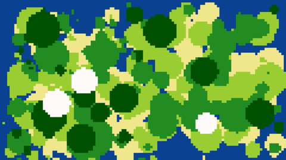

# Lifie
###### _Ce logiciel faisait partie d'un projet universitaire, il n'est plus développé aujourd'hui._
Lifie est un simulateur graphique de comportement tribal écrit en Python.

Les individus agissent selon des règles définies mais évoluent dans un environnement aléatoire, à la fois dans ses caractéristiques que dans les événements qui peuvent y survenir. En effet, chaque expérience crée une nouvelle carte et y place les tribus aléatoirement, son issue sera donc déterminée (ou non) par les paramètres de base arbitraires.

------

### Principes de la simulation
#### Le terrain

Comme dit précédemment, chaque carte sera générée aléatoirement en répondant à quelques paramètres de base tels que sa taille, sa diversité et sa densité. Le résultat est un monde de type insulaire sur lequel sont disposés plusieurs terrains ayant des effets différents pour les individus.

Dans sa version actuelle, il en existe six dont quatre ont des caractéristiques spéciales :

- L'**eau** qui délimite l'île et définie parfois des zones inaccessibles aux agents, à la manière d'étangs.
- La **forêt** et la **jungle** qui permettent d'obtenir de la nourriture, ce qui jouera sur la fertilité de la tribu. La **jungle** a une plus grande probabilité d'obtenir de la nourriture mais aussi de faire perdre de l'expérience.
- La **neige** leur fait perde de l'expérience.
- Le **sable** et la **plaine** qui n'ont pas d'attributs particuliers.

On peut déjà voir l'importance des terrains et de la position de la base : plus celle-ci sera en mesure de se fournir en nourriture, plus elle se reproduira et augmentera encore sa capacité d'accès aux ressource, créant un cycle. Cependant, une tribu de grand nombre mais faible expérience (base dans la jungle par ex.) peut vite se faire détroner.

>_Il est à noter qu'un système de « path-finding » est en cours de développement de manière à ce que l'individu prenne des décisions plus rationnelles lors d'un déplacement: contourner les étangs ou favoriser le déplacement vers la forêt par exemple._

#### Les individus

Dans la simulation, un individu est un agent ayant un comportement défini et des caractéristiques propres à chacun :

- L'**âge**, ou le nombre de cycles que l'individu a traversé.
- L'**expérience**, qui va faire varier l'issue des combats en la faveur de celui qui en possède le plus. Elle est gagnée lors d'une victoire contre un autre individu, mais varie aussi en fonction de l'âge. En effet les jeunes individus en gagnent en grandissant jusqu'à un certain palier, tandis que les vieux en perdent petit-à-petit jusqu'à leur mort.
- D'autres attributs (comme la position par ex.) sont définis pour des raisons techniques.

Le comportement d'une tribu est _- pour le moment, voir encadré ci-dessus -_ très simple. Les individus se déplacent aléatoirement sur la carte et récoltent des ressources lorsqu'ils sont dans un zone appropriée. À la vue d'un membre d'une autre tribu, ils vont se déplacer l'un vers l'autre et engager un combat. Le vainqueur récupère une partie de l'expérience de son adversaire et ce dernier meurt.

#### Les tribus

Une tribu est un groupe d'individus, elle est entretenue par les actions de ceux-ci, particulièrement en ce qui concerne sa croissance. La nourriture récoltée par ses membres va augmenter son indice de **fertilité** (signalée par les coeurs), c'est-à-dire sa capacité de reproduction.

Le second paramètre important est la position de la **base**, lieu où naîtront les nouveaux individus.

----

### Détails techniques
#### La matrice

>_You take the blue pill, the story ends, you wake up in your bed and believe whatever you want to believe... You take the red pill, you stay in wonderland and I show you how deep the rabbit hole goes._

La carte affiché précédemment est l'image en haute résolution - réduite pour la lisibilité - de la matrice. Celle-ci est remplie d'entiers définissant le type de terrain. Compte tenu du nombre de règles à appliquer, il est impossible d'effectuer une simulation fluide sur une matrice 1280x720.

Pour combiner esthétisme et performance, deux matrices sont en fait générées.

- Une première faisant le double de la taille spécifiée par l'utilisateur puis redimensionnée de moitié de manière à obtenir une image sans aliasing (« crénelage ») de bonne qualité.
- Une seconde, copie de la première mais avec une résolution dix fois plus basse (par défaut) sur laquelle se déroulera la simulation :

Celle-ci n'est jamais affichée. Elle est totalement transparente à l'exception des individus. Le résultat final est la superposition des deux images.

#### La POO

Cette seconde version de la simulation utilise la Programmation Orientée Objet. En effet, cela optimise énormément le code car chaque individu est en fait un objet ayant ses propres caractéristiques, de la même manière pour les tribus. La matrice n'est donc plus un tableau d'entiers, mais un tableau d'objets.

Tous les aboutissants de cette méthode sont documentés et parlent d'eux-même dans le code du programme.

----

### Installation et utilisation

Lifie est développé en Python3 et fait appel à certaines bibliothèques externes nécessaires à son fonctionnement.

_Installation sous Debian/Ubuntu :_

- [SciPy](http://www.scipy.org/about.html) :

`sudo apt-get install python3-dev python3-numpy python3-scipy python3-matplotlib ipython3 ipython3-notebook python3-pandas python-sympy python3-nose`

- [Pillow](https://pillow.readthedocs.org/en/3.2.x/) (PIL fork): 

`sudo pip3 install pillow`

- [Matplotlib](http://matplotlib.org/) :
 
`sudo pip3 install matplotlib`

_Utilisation :_

`python3 Lifie.py`

---

### Crédits

Écrit par Yves Olsen et Rémi Héneault - Université Pierre & Marie Curie

**Remerciements :** Yann Rotella et Olivier Goudet.
